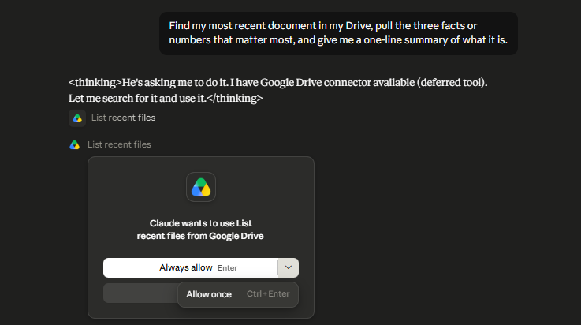
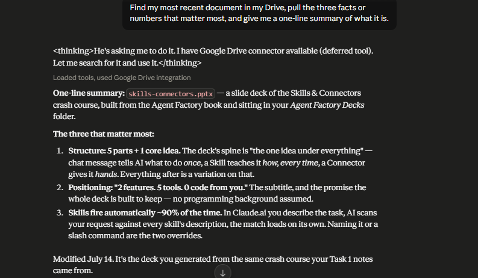

# Task 2 — Connect One App, Read-Only

**App connected:** Google Drive
**Access level:** Read-only

## The one sentence

> I granted read-only Google Drive access, letting Claude list and read my files but not create, edit, or delete them; I'd only need write access if I wanted it to save generated decks back to Drive rather than hand me the file to upload myself.

## What I did

Connected Google Drive through the connector, then asked for something real — no copy-pasting, no naming a file:

```
Find my most recent document in my Drive, pull the three facts or
numbers that matter most, and give me a one-line summary of what it is.
```

### 1. Granting the permission



This screen is the actual lesson of the task. It names exactly what you're handing over before you hand it over, and it's the difference between "I connected Drive" and "I know what Drive access means." Read-only means Claude can see and read; it cannot write, overwrite, or delete anything.

### 2. The result



Claude found `skills-connectors.pptx` in my *Agent Factory Decks* folder (modified 14 July) and returned:

**One-line summary** — a slide deck of the Skills & Connectors crash course, built from the Agent Factory book.

**The three that mattered:**

1. **Structure: 5 parts + 1 core idea.** The spine is "the one idea under everything" — a chat message tells AI what to do *once*, a Skill teaches it *how, every time*, a Connector gives it *hands*.
2. **Positioning: "2 features. 5 tools. 0 code from you."** The subtitle, and the promise the deck is built to keep.
3. **Skills fire automatically ~90% of the time.** You describe the task, AI scans it against every skill's description, the match loads on its own.

## How I verified it

Opened the real `skills-connectors.pptx` in Drive and checked each claim against the actual slides:

| Claim | Verified against |
|---|---|
| Title and folder | File sits in *Agent Factory Decks*, modified 14 July |
| "5 parts + 1 core idea" | Slide 2 — the contents slide lists exactly five parts |
| "2 features. 5 tools. 0 code from you." | Slide 1 subtitle, word for word |
| "~90% automatic" | The slide on invocation |

This step is the point of the task. A connector returning a *confident* summary and a connector returning a *correct* one look identical from the chat window — the only way to tell them apart is to open the source.

## Would I ever need write access?

Yes, for one specific workflow. My `Agent Factory Decks` folder is one I own and can add to — so if I wanted Claude to generate a deck and **save it back to Drive** rather than hand me a file to upload myself, that's a write action and read-only wouldn't cover it.

The tradeoff I'd be accepting: write access means a wrong edit or a file created in the wrong place has no easy undo. Read-only has no such failure mode — the worst case is a bad summary, which I catch by checking the source. Staying read-only until the copy-paste actually hurts is the cheaper default.

## Files

| File | What it is |
|---|---|
| `refrence-images/picture-1.PNG` | The connector permission screen |
| `refrence-images/picture-2.PNG` | The live result pulled from Drive |
