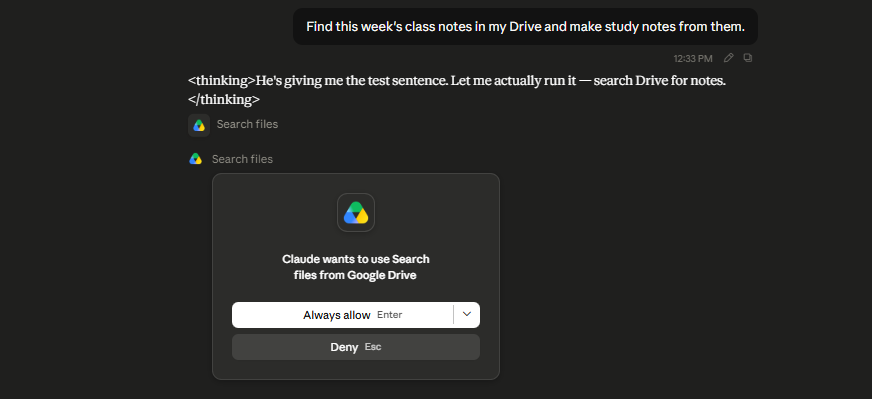

# Task 3 — Wire Skill + Connector Together

**Skill:** `weekly-study-notes` (from Task 1)
**Connector:** Google Drive (read-only, from Task 2)

## The workflow

One plain-English sentence. No copy-paste, no file upload, no naming the skill or the connector:

```
Find this week's class notes in my Drive and make study notes from them.
```

That sentence has two halves, and each half is handled by a different feature:

| Half of the sentence | What handles it | What it does |
|---|---|---|
| "Find this week's class notes in my Drive" | **Connector** (access) | Searches Drive, finds the file, reads the content |
| "make study notes from them" | **Skill** (expertise) | Formats it into my exact study-tool artifact |

This is the pattern from the course: **the Connector fetches the real data; the Skill shapes the output my way.** Neither is useful alone here — a connector without the skill hands me a raw dump, a skill without the connector needs me to paste the file in by hand.

## What happened

1. Drive was searched for class notes.
2. Found `class notes thesis` — a Markdown file in my *Agent Factory Decks* folder, modified 17 July.
3. The file content was read through the connector.
4. The skill formatted it: **10 sheets, 50 tap-to-reveal callouts, 3 scored questions.**

The source was The Agent Factory Thesis — a long, dense chapter. The output is `study-notes-agent-factory-thesis.html`.



## Spot-check against the source

Step 3 of the task, and the part that matters. Opened the real `class notes thesis` file in Drive and checked specific claims from the artifact against it:

| Claim in the artifact | Sheet | Verified in source? |
|---|---|---|
| Cursor: 35% of merged PRs from autonomous agents, Feb 2026 | 05 | YES |
| 74% run completion without durable execution, ~99.7% with step memoization | 09 | YES |
| US data center construction $42B annualized; office construction down 35% | 10 | YES |
| Four payment rails: ACP, AP2, x402, MPP | 06 | YES |

A connector returning a *confident* summary and one returning a *correct* summary look identical from the chat window. Opening the source is the only way to tell them apart — which is why the task grades this step and not the "did it produce something" step.

## What worked

- **The one-sentence workflow held.** No copy-paste at any point. The file never left Drive; it was found, read, and formatted from a single request.
- **Read-only was enough.** The whole workflow needed nothing but read access — the artifact came back to me as a file, not written back to Drive.
- **The skill handled a source it wasn't designed for.** It was built for messy lecture fragments; the thesis is a long, already-structured chapter. It still grouped the material into sheets and pulled five terms each.

## What didn't

- **The auto-fire is still unproven.** This ran in a chat where the skill's full text was already loaded, so I can't claim from this run that the *description* triggered it. Same open item as Task 1 — it closes with one fresh-chat test.
- **"This week's" did no work.** The connector matched on filename keywords, not on the date range in my sentence. If I'd had three notes files in Drive, the right one being picked would have been luck. A more precise sentence — or fewer files — is doing the work here, not the phrase "this week's."

## Files

| File | What it is |
|---|---|
| `weekly-study-notes/SKILL.md` | The skill (same one as Task 1) |
| `study-notes-agent-factory-thesis.html` | The live result — formatted from data pulled straight out of Drive |
| `screenshots/01-combined-workflow.png` | The workflow running end to end |
