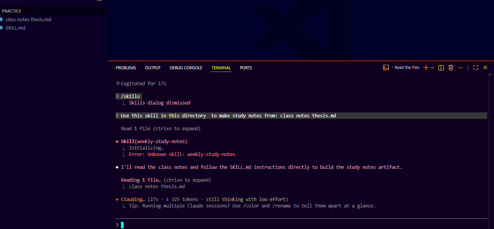
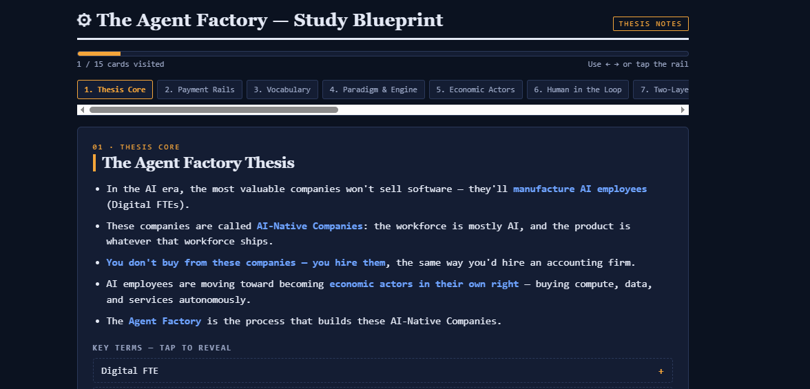

# Task 4 — Make It Portable or Hand It Off

**Path chosen:** Make it portable
**Second surface:** Claude Code
**Result:** The skill runs outside the chat it was built in.

## The idea

A skill that only works in the one conversation that created it isn't an asset — it's a trick. Task 4 is the proof that it's real: the same `SKILL.md`, a different surface, no re-explaining.

This matters because of what a skill actually is. It's a folder with a text file in it — a name, a description, plain-English instructions. Nothing in that is tied to Claude.ai. In December 2025 Anthropic published the **Agent Skills open standard** (agentskills.io), and the format now reads across tools. So the same folder should just work somewhere else.

That's the claim. This task tests it.

## What I did

1. Took the exact same `weekly-study-notes/` folder from Task 1 — unchanged, not a rewrite.
2. Loaded it into **Claude Code**.
3. Ran the skill against real class notes, using a plain request — no re-explaining the format.
4. Confirmed the output matched what the skill produces in Claude.ai.

### 1. The request

<!-- TODO: paste the exact line you typed, and note whether the skill fired on its own
     or you had to name it. -->

### 2. The result

The same format came back: topic cards, five tap-to-reveal key terms each, a progress meter, and a scored three-question quiz. **Nothing was re-explained to get it** — the skill carried its own instructions across.

<!-- TODO: one line on how the output arrived — a file written to disk that you opened,
     or something else? -->

## What this proves

The skill survives outside its birthplace. Same `SKILL.md`, different surface, no extra explanation from me — which is the whole point of the task. A skill is a portable asset, not a property of one chat.

Worth noting what makes this different from the alternatives. **Custom GPTs** (ChatGPT) and **Gems** (Gemini) are powerful, but each lives only inside its own product — you can't take one elsewhere. A skill is a folder. It travels.

## The honest caveat

The course states this plainly and my run agrees with it: **a basic SKILL.md travels across skills-compatible tools, but each product adds its own install path, invocation syntax, and permissions on top. The core is portable; the edges differ.**

Concretely, the edges I hit moving from Claude.ai to Claude Code:

<!-- TODO: fill in what was actually different. Likely candidates —
     - install path: a shelf upload in Claude.ai vs a folder on disk in Claude Code
     - the output: Claude.ai renders an inline artifact; Claude Code writes a file to disk.
       Did you get a file instead of a rendered artifact? That's a real finding, not a failure —
       it's exactly the "edges differ" point, and it's the strongest thing you could report here.
     - invocation: did it auto-fire, or did you have to name it? -->

The instructions ported cleanly. What changed was the surrounding product, not the skill.

## Files

| File | What it is |
|---|---|
| `screenshots/01-claude-code-command.png` | The request, made in Claude Code |
| `screenshots/02-artifact-opened.png` | The artifact it produced, opened |

The skill itself lives in `task-1-my-skill/weekly-study-notes/SKILL.md` — deliberately not copied here, because the point of this task is that **it's the same file**, not a second version of it.
