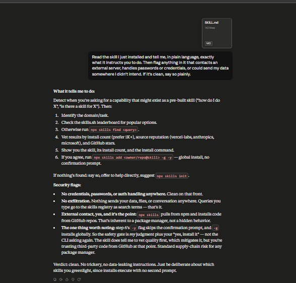

# Task 5 — Audit a Skill Before Trusting It

**Student:** Abdul Manan
**Program:** Panaversity — The AI Agent Factory (AI-101), Lecture 8: Skills & Connectors
**Skill audited:** `find-skills` (`vercel-labs/agent-skills`)
**AI tool used:** Claude (web)
**Apps connected:** None — this task is read-only inspection, no connector or account access involved
**Verdict:** ✅ Safe to enable, with conditions (see §6)

---

## Folder Contents

| File | What it is |
|---|---|
| `README.md` | This file — the full safety assessment |
| `find-skills-SKILL.md` | Copy of the audited skill, so you can verify my claims against the source |
| `screenshots/audit-response.png` | Claude reading the skill and producing the audit |
| `Task5_Skill_Audit_Report_Abdul_Manan.pdf` | Same assessment as a formatted PDF (supporting material) |



---

## 1. What This Project Is

A safety review of a third-party skill I did not write, carried out **before** deciding whether to trust it.

Task 5 isn't about building anything. It's about building the *habit* of vetting a skill before enabling it — and proving I can say in plain English what a skill does and whether it's safe, without reading a single line of code.

**The skill:** `find-skills` is a discovery helper from Vercel Labs. It does no real work of its own. It teaches the AI how to find *other* skills from the open agent-skills ecosystem (skills.sh) and install them via the `npx skills` CLI.

It's a shop assistant for the skills store: it doesn't build anything, it helps you find and install things other people built.

**Install method:** I uploaded the raw `SKILL.md` directly into Claude rather than installing through the CLI. This was deliberate — it let me read the instruction text *before* anything executed on my machine. Read first, execute second.

---

## 2. The Prompts I Used

### Initial prompt

```
Read this skill and tell me what it does.
```

Too loose. It invited a summary — and a summary is exactly what a malicious skill would want me to settle for. A friendly gloss instead of the actual instruction body. It also produced no safety analysis at all.

### Refined prompt (the one I used)

```
Read the skill I just installed and tell me, in plain language, exactly
what it instructs you to do. Then flag anything in it that contacts an
external server, handles passwords or credentials, or could send my data
somewhere I didn't intend. If it's clean, say so plainly.
```

### What the refinement changed, and why it mattered

- **"exactly what it instructs you to do"** — forces a walk through the actual instruction body, not the self-description in the frontmatter. A skill's description is marketing copy; the instructions are the contract.
- **Naming the three risk categories explicitly** — external server, credentials, unintended data egress. These are the exact three checks Task 5 asks for. Naming them stops the AI from picking its own definition of "sensitive."
- **"If it's clean, say so plainly"** — matters more than it looks. Without it, an AI will hedge and manufacture concerns to appear thorough, which trains me to ignore warnings. Explicitly permitting a clean verdict makes the flagged items meaningful when they do appear.

---

## 3. What the Skill Instructs the AI to Do — In Plain English

It activates when I ask things like *"how do I do X"*, *"is there a skill for X"*, or *"can you do X"* — anything that sounds like I want a capability that might already exist as a package. Once triggered, six steps:

1. **Understand the need** — identify the domain (React, testing, deployment…) and the specific task, then judge whether a skill plausibly exists.
2. **Check the leaderboard first** — look at the skills.sh homepage, which ranks by total installs, before running any search.
3. **Search the CLI** — if the leaderboard doesn't cover it, run `npx skills find <query>`.
4. **Verify quality before recommending** — the skill explicitly says *do not recommend based on search results alone*. Three checks: install count (prefer 1K+, cautious under 100), source reputation (`vercel-labs`, `anthropics`, `microsoft` over unknown authors), GitHub stars (<100 = skepticism).
5. **Present options to me** — name, what it does, install count, source, install command, skills.sh link.
6. **Offer to install** — if I agree, run `npx skills add <owner/repo@skill> -g -y`.

It also carries a category reference table (web dev, testing, DevOps, docs, code quality, design, productivity), search tips, and a fallback: if nothing's found, admit it, offer to help directly, suggest `npx skills init`.

---

## 4. Safety Assessment — The Three Flags

### Does it handle credentials or passwords?

**No.** No mention of tokens, API keys, OAuth, passwords, logins, or `.env` files anywhere in the file. It never asks me for a secret and never reads one.

### Does it send my data somewhere I didn't intend?

**No.** Nothing reads my files, conversation history, clipboard, or machine state and ships it out. The only thing leaving my machine is the **search query text I type** — e.g. "react performance" goes to the registry as a search term. Expected and unavoidable for any search tool, and not data I didn't intend to send.

### Does it contact an external server?

**Yes — and that's the entire point of the skill, not hidden behaviour.** Three destinations:

| Destination | Why it's contacted |
|---|---|
| `skills.sh` | Browse the leaderboard, retrieve skill listings |
| npm registry | `npx` downloads and runs the `skills` CLI package |
| GitHub | The actual skill packages are installed from GitHub repos |

Same trust model as `npm install` or `pip install`. Nothing disguised or undisclosed.

### The one thing genuinely worth flagging

Step 6 instructs:

```bash
npx skills add <owner/repo@skill> -g -y
```

- **`-g`** installs **globally** at user level — available in every project, not just the current one.
- **`-y`** **skips the confirmation prompt** — the CLI won't stop and ask "are you sure?"

The consequence: the safety gate is *not* the CLI double-checking. It's (1) the AI's own vetting from Step 4, and (2) my "yes, install it." After that, third-party code from a GitHub repo lands in my environment with no second prompt.

Standard supply-chain risk for any package manager — but worth being conscious of rather than clicking through on autopilot.

---

## 5. How I Tested and Verified It

- Uploaded the raw `SKILL.md` into Claude and asked it to read the file and explain, in plain language, exactly what it instructs — then flag the three risk categories.
- Deliberately did **not** rely on the skill's own frontmatter description. I had the full instruction body read step by step, because the description is what the author *wants* me to believe and the body is what actually runs.
- Cross-checked the three network destinations against what each step actually calls: `npx` resolves through npm, `skills find` queries skills.sh, `skills add` pulls from GitHub. The claimed egress matches the mechanical reality of the commands.
- Confirmed the negative findings by absence: searched the file for any reference to credentials, tokens, environment variables, file reads, or upload behaviour. There are none.
- The entire audit was done by reading plain English. No code literacy required — which is itself the point.

### Evidence


*Claude reading the uploaded `find-skills` SKILL.md and returning the plain-English audit: what it instructs, the three risk flags, and the verdict.*

---

## 6. Decision and Verdict

> ### ✅ Safe to enable.
> The skill does what it says, discloses its network access as an inherent function rather than a hidden one, handles no secrets, and exfiltrates nothing. I would enable it — with the conditions below.

### Why

- **No credential handling.** Clean entirely.
- **No exfiltration.** Search queries go out as search queries. That's the whole of it.
- **Network access is disclosed and inherent.** It contacts skills.sh, npm, and GitHub because that's literally what a package manager must do to function.
- **It actively encourages caution.** Step 4 tells the AI to vet install counts, source reputation, and stars *before* recommending. A malicious skill wouldn't include a vetting step that makes its own recommendations harder to accept.
- **No trickery.** No attempt to override my instructions, no "ignore previous rules", no silent behaviour, no obfuscation.

### Conditions I'm attaching to my own use

1. I won't treat the `-y` flag as permission to install carelessly. My "yes" *is* the confirmation prompt, so I'll actually read what's being installed before giving it.
2. I'll respect the skill's own advice: anything under 100 installs, from an unknown author, or from a repo with <100 stars gets skipped unless I have a specific reason.
3. The risk here isn't `find-skills` itself — it's whatever `find-skills` helps me install next. **This skill is a door, not a room.** I audit the room too.

---

## 7. What Worked, What Didn't, Problems Faced

### What worked

- Uploading the SKILL.md manually rather than installing through the CLI was the right call. It let me inspect the instructions before anything ran — the correct order for an audit.
- Naming the three risk categories directly in the prompt produced a structured answer mapped to the task requirements, instead of a vague "looks fine to me."
- The plain-English requirement held up. I genuinely didn't need to read code to reach a defensible verdict.

### What didn't work at first

- My initial prompt ("tell me what it does") returned a summary that paraphrased the skill's own description. Close to useless for an audit — I was being told what the author claims, not what the file instructs. Refining the prompt to demand the instruction body was the fix.
- My first instinct was to treat "contacts an external server" as automatically a red flag. It isn't. For a package manager, network access *is* the function. The real question isn't *whether* it phones out but *where, why, and whether that's disclosed*. Learning that distinction was the most useful part of this task.

### Problems faced

- **The clean-verdict trap.** There's real pressure in a security assignment to find something wrong, because a report saying "it's fine" feels like it did no work. I had to resist inventing concerns. The honest finding is that the file is clean, and the one genuine flag — the `-y` auto-confirm — is worth more than five manufactured ones.
- **Scope ambiguity.** It took a moment to realise the audit boundary. The skill is safe; the ecosystem it opens the door to is a separate question with a separate answer. Conflating the two would produce either a falsely alarming verdict or a falsely reassuring one.
- **Trusting the auditor.** I'm using an AI to audit a file that instructs an AI. If the file contained a prompt injection, the auditor could in principle be the thing compromised. Here the file is short enough to read myself as a cross-check, and I did — but that doesn't scale to a long or obfuscated skill, and the limitation is worth stating rather than hiding.

---

## 8. Takeaway

A skill can be completely clean and still be a gateway to risk. `find-skills` does nothing dangerous, but it *installs code from the internet with no second confirmation*. The audit isn't finished when I decide the file is safe — **it restarts every time this skill hands me a new one.**

That's the habit Task 5 is actually training: not "is this file malicious," but "do I understand what I'm agreeing to, every time I agree to it."
